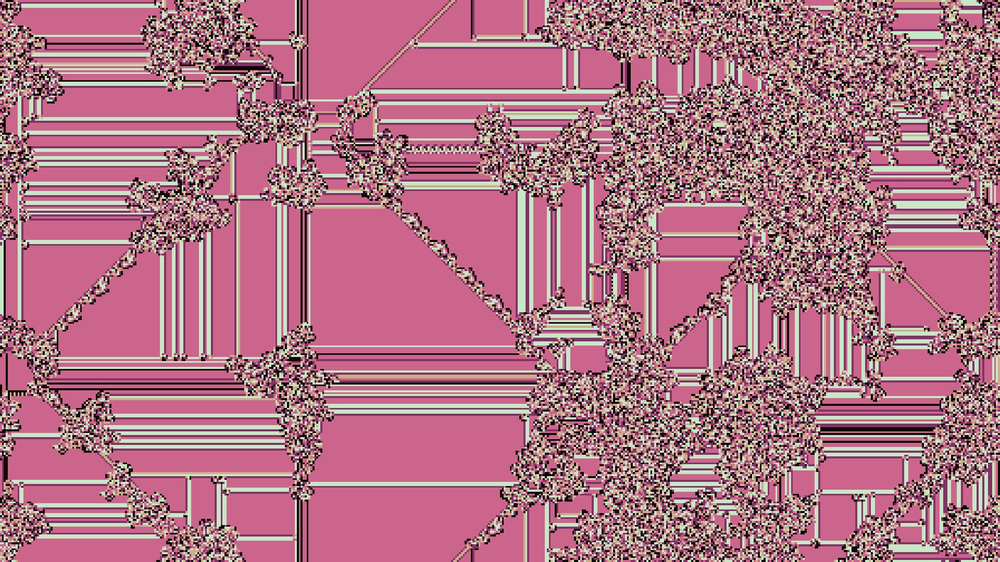
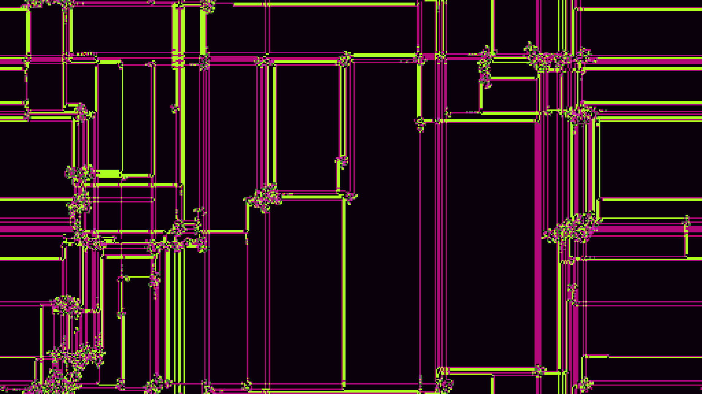
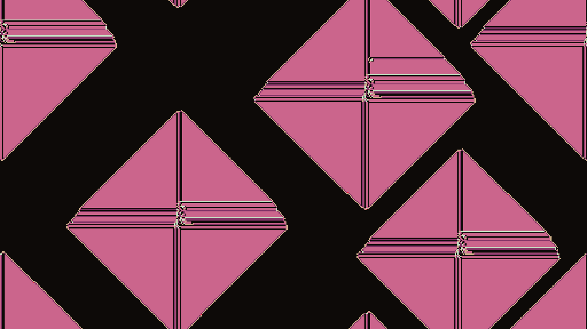
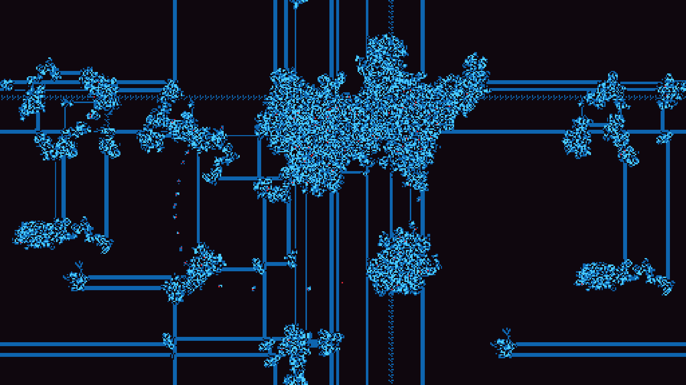
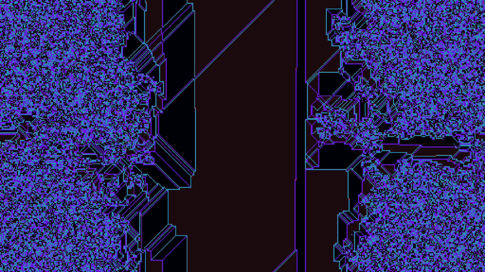
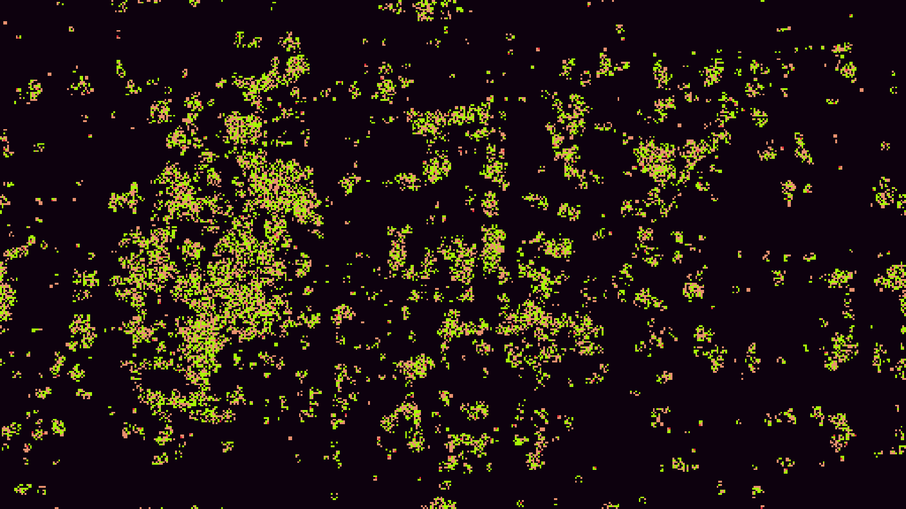
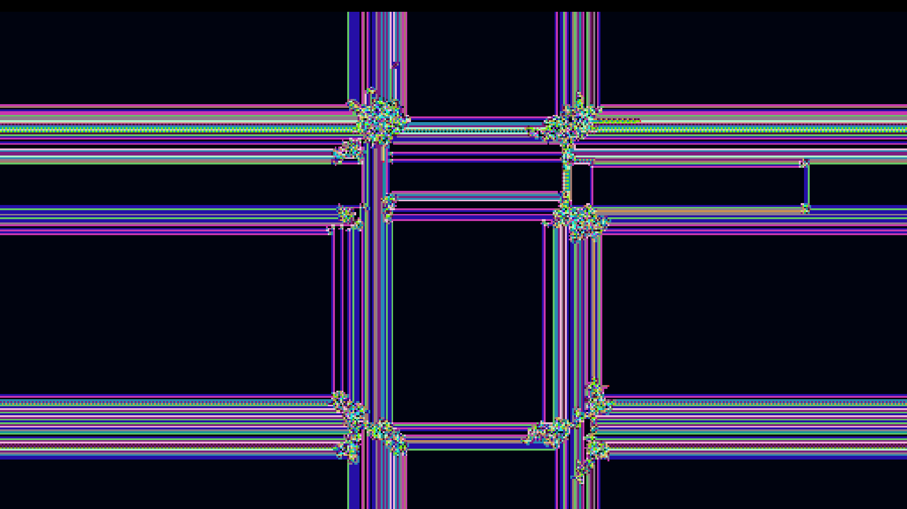

# Ant: A unique take on the classic game of [Langton's Ant](https://en.wikipedia.org/wiki/Langton%27s_ant)

This crate adapts Langton's Ant by allowing the ant to move in 4 directions (Up, Down, Left, Right) instead of just left and right.

To prevent the ant from just walking in a straight line, the board wraps around to the other side.

# Controls

s: take screenshot

r: reset the grid with new rules
    
e: exterminates all ants
    
c: change colors
    
d: spawn ant in the middle of the screen
    
w: write the state to the console
    
o: outputs the state into the clipboard
    
left click: spawn several ants at the cursor's position
    
right click: spawn only one ant at the cursor's position

# Screenshots

